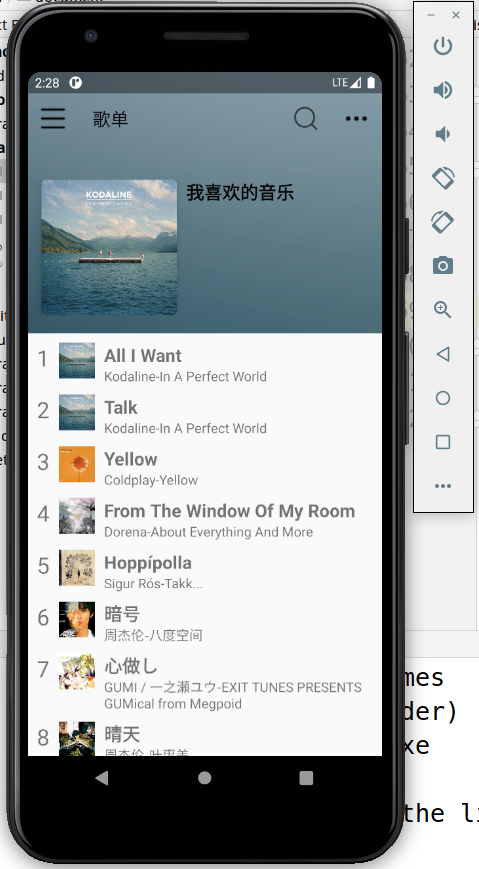
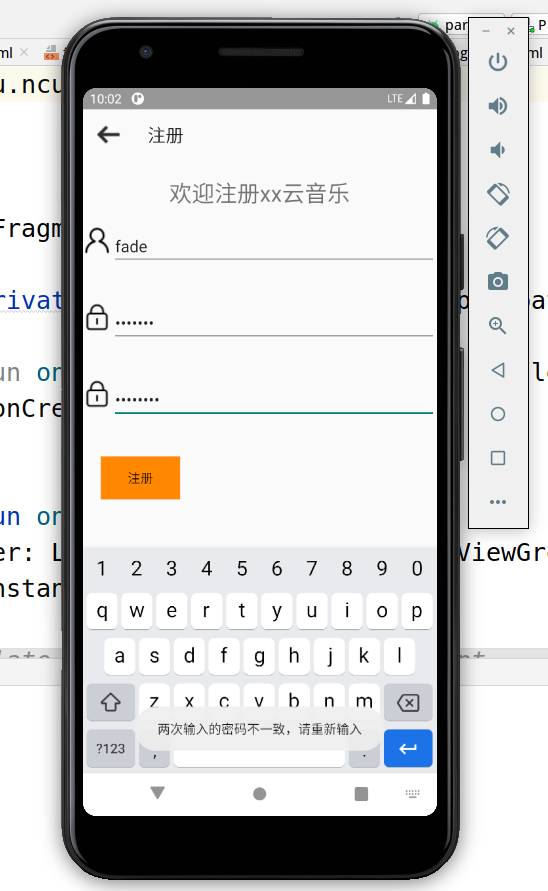

# MusicPlayerApp
#### 基于Android的在线音乐播放APP
# 写在开头
#### Android期末项目，由于时间有限及个人能力不足，并不是做得很好
# 框架技术
#### Retrofit RxJava
# 开发语言
#### kotlin
# API
#### 本项目API是基于[网易云音乐API NodeJS版](https://github.com/Binaryify/NeteaseCloudMusicApi)布置，并且仅供学习使用，如有侵权，请联系本人
# 实现功能
#### 1、播放内置音乐
#### 2、播放界面图片旋转
#### 3、高斯模糊背景
#### 4、快进音乐
#### 5、快退音乐
#### 6、下一首播放
#### 7、上一首播放
#### 8、通知栏及通知栏控制播放
#### 9、播放在线音乐（仅实现推荐歌单接口，但不是每日推荐接口（需登录网易云））
#### 10、简单登录注册及验证（手机或模拟器数据库）
#### 11、沉浸式状态栏
# 未实现功能
#### 1、播放热门单曲（实现接口即可）
#### 2、搜索功能（实现接口即可）
#### 3、修改个人信息
#### 4、应用设置
#### 5、帮助信息
#### ......
# BUG/不足
#### 1、在线播放界面通知栏RemoteView点击切歌时会显示异常
#### 2、歌词在快退播放时未能更新
#### 3、在等待网络信息返回时点击界面会闪退
#### 4、未能实现自动播放下一首
#### 5、未能完全使用Retrofit和RxJava框架/未根据框架来实现项目 导致大量冗余代码及BUG
#### 6、前台Service在退出应用程序后，通知栏会消失
#### ......
# 项目运行截图

# 参考资料
#### [1] [网易云音乐 NodeJS 版 API](https://binaryify.github.io/NeteaseCloudMusicApi/#/)
#### [2] [网易云音乐Android 3.0视觉设计规范文档](https://www.25xt.com/appdesign/12385.html)
#### [3] [Android：简单靠谱的动态高斯模糊效果](https://www.iamxiarui.com/?p=854)
#### [4] [Android App 沉浸式状态栏解决方案](https://jaeger.itscoder.com/android/2016/02/15/status-bar-demo.html)
#### [5] [Android RoundedBitmapDrawable：Android官方的圆角图形图象实现方案](https://blog.csdn.net/zhangphil/article/details/51829650)
#### [6] [Android 之 Bitmap等比缩放](https://blog.csdn.net/jky_yihuangxing/article/details/52605136)
#### [7] [Android 自定义圆形进度条带图片旋转](https://zhuanlan.zhihu.com/p/113370351)
#### [8] [给 Android 开发者的 RxJava 详解 ](https://gank.io/post/560e15be2dca930e00da1083)
#### [9] [这可能是最好的RxJava 2.x 教程（完结版）](https://www.jianshu.com/p/0cd258eecf60)
#### [10] [网易云音乐 Android 版使用的开源组件](https://www.jianshu.com/p/f31ab96a32f3)
#### ......
# 联系方式
#### fadepi666@gmail.com
